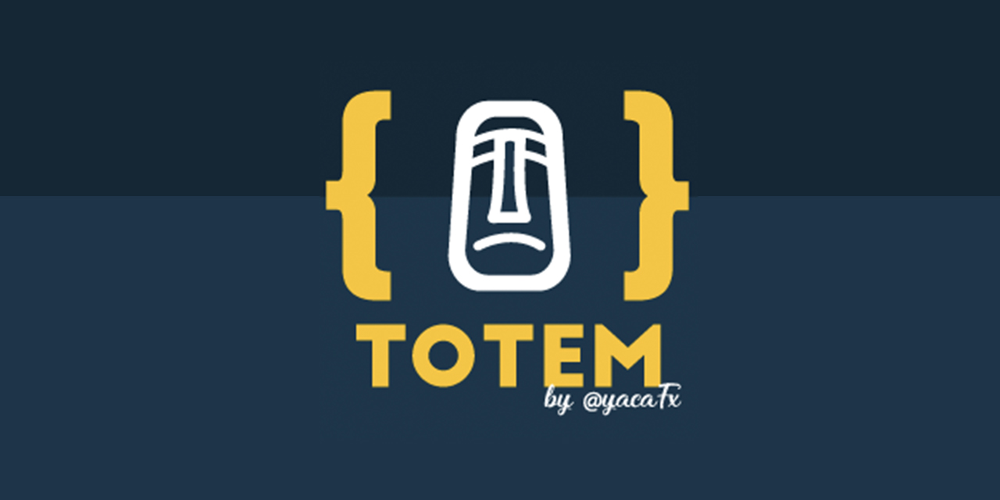

# 🗿 TOTEM Theme for Visual Studio Code

<!-- [](https://marketplace.visualstudio.com/items?itemName=yacafx.theme-totem) -->



This theme is an italicized version of Cobalt2, with fonts that supports cursive italicized fonts.

## Credits

This theme is adapted from [Cobalt Official theme by Wes Bos](https://marketplace.visualstudio.com/items?itemName=wesbos.theme-cobalt2) and [Winter is Coming Theme by John Papa](https://marketplace.visualstudio.com/items?itemName=johnpapa.winteriscoming). Is a combination of colors and configurations from both themes and some configurations that I use for my daily coding basis.

The Totem logo was made by [Lala Ramirez](https://www.behance.net/lilalaila), go and check her cool and awesome designs on [Behance](https://www.behance.net/lilalaile) or at her [Facebook Fan Page](https://www.facebook.com/lilalailas)

## How to use the theme

1. Install the theme "🗿 Totem"
2. Install recommended extensions
3. Update your Visual Studio settings

## Recommended Extensions

```bash
code --install-extension 2gua.rainbow-brackets
code --install-extension aaron-bond.better-comments
code --install-extension abusaidm.html-snippets
code --install-extension alefragnani.jenkins-status
code --install-extension Angular.ng-template
code --install-extension anseki.vscode-color
code --install-extension ashinzekene.nestjs
code --install-extension be5invis.vscode-custom-css
code --install-extension bibhasdn.unique-lines
code --install-extension bmalehorn.vscode-fish
code --install-extension BriteSnow.vscode-toggle-quotes
code --install-extension christian-kohler.npm-intellisense
code --install-extension christian-kohler.path-intellisense
code --install-extension cmstead.jsrefactor
code --install-extension CoenraadS.bracket-pair-colorizer
code --install-extension cssho.vscode-svgviewer
code --install-extension DavidAnson.vscode-markdownlint
code --install-extension dbaeumer.vscode-eslint
code --install-extension deerawan.vscode-dash
code --install-extension donjayamanne.githistory
code --install-extension dsznajder.es7-react-js-snippets
code --install-extension eamodio.gitlens
code --install-extension EditorConfig.EditorConfig
code --install-extension eg2.vscode-npm-script
code --install-extension esbenp.prettier-vscode
code --install-extension fabiospampinato.vscode-open-multiple-files
code --install-extension firefox-devtools.vscode-firefox-debug
code --install-extension formulahendry.auto-rename-tag
code --install-extension formulahendry.github-actions
code --install-extension glen-84.sass-lint
code --install-extension Gruntfuggly.todo-tree
code --install-extension hangxingliu.vscode-nginx-conf-hint
code --install-extension hbenl.vscode-jasmine-test-adapter
code --install-extension hbenl.vscode-test-explorer
code --install-extension HookyQR.beautify
code --install-extension humao.rest-client
code --install-extension ivory-lab.jenkinsfile-support
code --install-extension janjoerke.jenkins-pipeline-linter-connector
code --install-extension jkjustjoshing.vscode-text-pastry
code --install-extension joelday.docthis
code --install-extension johnpapa.Angular2
code --install-extension johnpapa.vscode-peacock
code --install-extension jpoissonnier.vscode-styled-components
code --install-extension KnisterPeter.vscode-github
code --install-extension kumar-harsh.graphql-for-vscode
code --install-extension lunaryorn.fish-ide
code --install-extension mads-hartmann.bash-ide-vscode
code --install-extension mechatroner.rainbow-csv
code --install-extension Mikael.Angular-BeastCode
code --install-extension mikestead.dotenv
code --install-extension mrmlnc.vscode-apache
code --install-extension mrmlnc.vscode-scss
code --install-extension ms-azuretools.vscode-docker
code --install-extension ms-dotnettools.csharp
code --install-extension ms-python.python
code --install-extension ms-vscode.cpptools
code --install-extension ms-vscode.vscode-typescript-tslint-plugin
code --install-extension ms-vsliveshare.vsliveshare
code --install-extension ms-vsliveshare.vsliveshare-audio
code --install-extension ms-vsliveshare.vsliveshare-pack
code --install-extension msjsdiag.debugger-for-chrome
code --install-extension msjsdiag.debugger-for-edge
code --install-extension natewallace.angular2-inline
code --install-extension norato.storybook-snippets
code --install-extension nrwl.angular-console
code --install-extension pflannery.vscode-versionlens
code --install-extension pnp.polacode
code --install-extension Prisma.vscode-graphql
code --install-extension raynigon.nginx-formatter
code --install-extension redhat.vscode-yaml
code --install-extension rogalmic.bash-debug
code --install-extension ryu1kn.partial-diff
code --install-extension secanis.jenkinsfile-support
code --install-extension shakram02.bash-beautify
code --install-extension Shan.code-settings-sync
code --install-extension shanoor.vscode-nginx
code --install-extension skyapps.fish-vscode
code --install-extension SonarSource.sonarlint-vscode
code --install-extension syler.sass-indented
code --install-extension techer.open-in-browser
code --install-extension Tyriar.lorem-ipsum
code --install-extension Tyriar.sort-lines
code --install-extension vector-of-bool.gitflow
code --install-extension VisualStudioExptTeam.vscodeintellicode
code --install-extension vscode-icons-team.vscode-icons
code --install-extension WallabyJs.quokka-vscode
code --install-extension WallabyJs.wallaby-vscode
code --install-extension wayou.vscode-todo-highlight
code --install-extension william-voyek.vscode-nginx
code --install-extension wix.vscode-import-cost
code --install-extension xabikos.JasmineSnippets
code --install-extension xabikos.JavaScriptSnippets
code --install-extension Yummygum.city-lights-icon-vsc

```

## Recommended settings

```json
{
  "[typescript]": {
    "editor.defaultFormatter": "esbenp.prettier-vscode",
    "editor.codeActionsOnSave": {
      "source.organizeImports": true,
      "source.fixAll": true
    }
  },
  "breadcrumbs.enabled": true,
  "city-lights-icons-vsc.hidesExplorerArrows": false,
  "diffEditor.ignoreTrimWhitespace": false,
  "editor.autoIndent": "full",
  "editor.cursorBlinking": "smooth",
  "editor.cursorSmoothCaretAnimation": true,
  "editor.cursorStyle": "block",
  "editor.cursorWidth": 5,
  "editor.defaultFormatter": "esbenp.prettier-vscode",
  "editor.fontFamily": "Dank Mono, Victor Mono, JetBrainsMono",
  "editor.fontLigatures": true,
  "editor.fontSize": 18,
  "editor.fontWeight": "400",
  "editor.formatOnPaste": true,
  "editor.formatOnType": false,
  "editor.formatOnSave": true,
  "editor.letterSpacing": 0.4,
  "editor.lineHeight": 25,
  "editor.minimap.enabled": false,
  "editor.renderWhitespace": "all",
  "editor.rulers": [60, 80, 100, 120],
  "editor.snippetSuggestions": "top",
  "editor.suggestSelection": "first",
  "editor.wordWrap": "on",
  "eslint.alwaysShowStatus": true,
  "explorer.sortOrder": "type",
  "files.autoSave": "onFocusChange",
  "files.trimTrailingWhitespace": true,
  "git.enableSmartCommit": true,
  "gitlens.advanced.messages": {
    "suppressShowKeyBindingsNotice": true
  },
  "gitlens.mode.active": "zen",
  "html.format.enable": true,
  "html.format.endWithNewline": true,
  "html.format.indentHandlebars": true,
  "html.format.preserveNewLines": true,
  "html.format.wrapAttributes": "force-aligned",
  "html.format.wrapLineLength": 80,
  "javascript.format.insertSpaceAfterConstructor": true,
  "javascript.implicitProjectConfig.experimentalDecorators": true,
  "javascript.updateImportsOnFileMove.enabled": "always",
  "liveshare.featureSet": "insiders",
  "npm.enableScriptExplorer": true,
  "peacock.affectActivityBar": true,
  "peacock.affectStatusBar": true,
  "peacock.color": "#42b883",
  "peacock.favoriteColors": [
    {
      "name": "Angular Red",
      "value": "#b52e31"
    },
    {
      "name": "Auth0 Orange",
      "value": "#eb5424"
    },
    {
      "name": "Azure Blue",
      "value": "#007fff"
    },
    {
      "name": "C# Purple",
      "value": "#68217A"
    },
    {
      "name": "Gatsby Purple",
      "value": "#639"
    },
    {
      "name": "Go Cyan",
      "value": "#5dc9e2"
    },
    {
      "name": "Java Blue-Gray",
      "value": "#557c9b"
    },
    {
      "name": "JavaScript Yellow",
      "value": "#f9e64f"
    },
    {
      "name": "Mandalorian Blue",
      "value": "#1857a4"
    },
    {
      "name": "Node Green",
      "value": "#215732"
    },
    {
      "name": "React Blue",
      "value": "#00b3e6"
    },
    {
      "name": "Something Different",
      "value": "#832561"
    },
    {
      "name": "Vue Green",
      "value": "#42b883"
    }
  ],
  "prettier.singleQuote": true,
  "search.showLineNumbers": true,
  "terminal.integrated.fontFamily": "Dank Mono,  Victor Mono, JetBrainsMono",
  "terminal.integrated.fontSize": 18,
  "terminal.integrated.letterSpacing": 0.3,
  "todo-tree.tree.showScanModeButton": false,
  "typescript.format.insertSpaceAfterConstructor": true,
  "typescript.updateImportsOnFileMove.enabled": "always",
  "vscode_custom_css.imports": [
    // Mac/Linux: file:///Users/YOUR-PC-USERNAME/.vscodestyles.css
    // Windows: file:///C:/Users/YOUR-PC-USERNAME/.vscodestyles.css
    "file:///Users/yacafx/confs/vscode-styles.css"
  ],
  "vsicons.presets.angular": true,
  "vsicons.projectDetection.autoReload": true,
  "vsintellicode.modify.editor.suggestSelection": "automaticallyOverrodeDefaultValue",
  "wallaby.startAutomatically": false,
  "window.nativeTabs": true,
  "window.zoomLevel": 0,
  "workbench.colorCustomizations": {
    "activityBar.activeBorder": "#945bc4",
    "activityBar.background": "#65c89b",
    "activityBar.foreground": "#15202b",
    "activityBar.inactiveForeground": "#15202b99",
    "activityBarBadge.background": "#945bc4",
    "activityBarBadge.foreground": "#e7e7e7",
    "statusBar.background": "#42b883",
    "statusBar.foreground": "#15202b",
    "statusBarItem.hoverBackground": "#359268",
    "titleBar.activeBackground": "#42b883",
    "titleBar.activeForeground": "#15202b",
    "titleBar.inactiveBackground": "#42b88399",
    "titleBar.inactiveForeground": "#15202b99"
  },
  "workbench.colorTheme": "🗿 Totem",
  "workbench.editor.closeEmptyGroups": false,
  "workbench.editor.highlightModifiedTabs": true,
  "workbench.editor.tabCloseButton": "off",
  "workbench.editor.tabSizing": "shrink",
  "workbench.enableExperiments": false,
  "workbench.iconTheme": "city-lights-icons-vsc-light",
  "workbench.settings.enableNaturalLanguageSearch": false,
  "workbench.sideBar.location": "right",
  "workbench.startupEditor": "none",
  "zenMode.centerLayout": false
}
```
